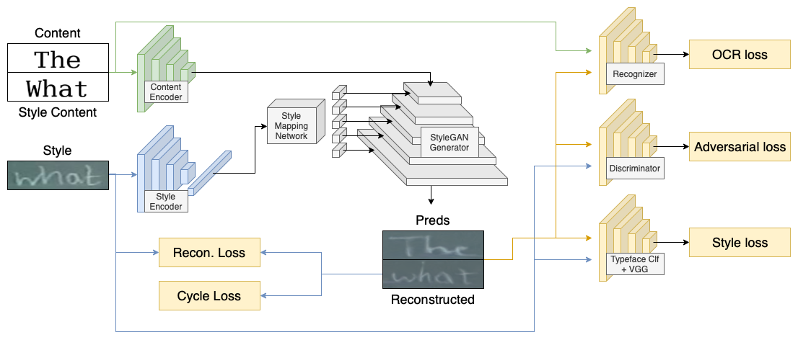
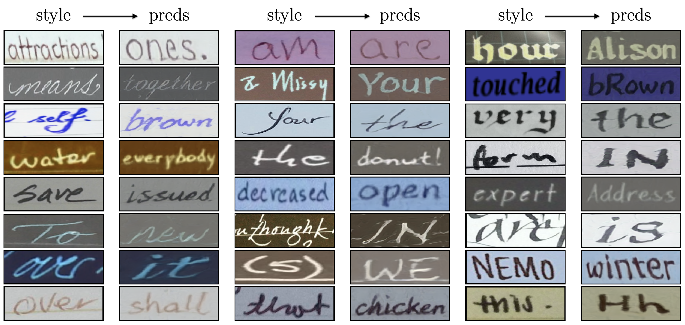

# Text-deep-fake

This project aims to implement neural network architecture, described in [Krishnan et al. (2021) -- Text Style Brush](https://arxiv.org/pdf/2106.08385.pdf). 

Our implementation is unofficial and might contain some differences from the origin implementation. You can find a [link](docs/project_presentation.pdf) to slides from project presentation as well.

## How to run ?

- Install requirements `pip install -r requirements.txt`
- Choose config file in `src/config` folder
- Log in into wandb if needed `wandb login`
- Download `models` folder from [cloud](https://disk.yandex.ru/d/gTJa6Bg2QW0GJQ) this folder contains all pretrained models which we use. This folder should be in root folder as shown below.
- Download IMGUR5K dataset: use original `download_imgur5k.py` script which you can find [here](https://github.com/facebookresearch/IMGUR5K-Handwriting-Dataset). You can clone whole origin repo, it will be easier. Tip: there is a [PR with parallel execution](https://github.com/facebookresearch/IMGUR5K-Handwriting-Dataset/pull/5) of image download.
- Add `prepare_dataset.py` script in that repo and run it to preprocess files as we did it.
- Put prepared dataset in `data/` folder of this project.
- Run `python3 run.py './src/config/<chosen config>'`. In the most cases `python3 run.py './src/config/stylegan_adversarial.py'`. 

## Repo structure

```
├── run.py                  <- [entry point]
│
├── prepare_dataset.py      <- [our preprocess of images]
│
├── requirements.txt        <- [necessary requirements]
│
├── data                    <- [necessary data (including downloaded datasets)]
|
├── docs                    <- [docs and images]
|
├── models                  <- [pretrained models -- download this folder from cloud]
|
├── src                     <- [project source code]
│   ├── config 
│   │   ├── simple.py           <- [Template Config]
│   │   ├── gan.py
│   │   ├── ...
│   │
│   ├── data
│   │   ├── simple.py           <- [Template CustomDataset]
│   │   ├── ...
│   │
│   ├── disk
│   │   ├── disk.py             <- [Disk class to upload and download data from cloud]
│   │   ├── ...
│   │
│   ├── logger
│   │   ├── simple.py           <- [Logger class to log train and validation process]
│   │   ├── ...
│   │ 
│   ├── losses
│   │   ├── ocr.py              <- [Recognizer Loss]
│   │   ├── perceptual.py
│   │   ├── ...
│   │
│   ├── metrics
│   │   ├── accuracy.py         <- [Accuracy Metric]
│   │   ├── ...
│   │
│   ├── models
│   │   ├── ocr.py              <- [Model for CTC Loss]
│   │   ├── ...
│   │
│   ├── storage
│   │   ├── simple.py           <- [Storage class to save models' checkpoints]
│   │   ├── ...
│   │
│   ├── training
│   │   ├── simple.py           <- [Template Trainer]
│   │   ├── stylegan.py
│   │   ├── ...
│   │
│   ├── utils
│   │   ├── download.py         <- [Tool to download data from remote to cloud]
│   │   ├── ...
│   │
│   ├── ...
```

## Architecture

We started our work from a very simple architecture, shown below:


We call it baseline and you can find its config [here](src/config/baseline.py). We did it because we could and because we needed something to set up work space.

Anyway, we ended up with this architecture, very similar to TextStyleBrush:



You can find its config [here](src/config/stylegan_adversarial.py). It's not perfect, but we did our best -- you can check out results below.

Before you do, there are differences with the original paper:

| Subject  | Us     | TextStyleBrush|
|-----------|--------|---------------|
| Generator | styleGAN| styleGAN2 |
| Encoders | resNet18 | resNet34|
| Style loss model| VGG16 | VGG19 |
| Input style size| 64 x 192 | 256 x 256|
| Input content size| 64 x 192 | 64 x 256 |
| Soft masks | no | yes|
| Adversarial loss | MSE | non-saturating loss with regularization |
| Discriminator | NLayerDiscriminator | ?? | 
| Text recognizer | TRBA | ?? |
| Hardware | Google Colab resources : ) | 8GPUS with 16GB of RAM |

## Results



## Datasets 

### Imgur5K

We trained our model using [Imgur5K](https://github.com/facebookresearch/IMGUR5K-Handwriting-Dataset) dataset. You can download it using instruction from the origin repo. 

Other way is to use our script which hasn't been uploaded to the repo yet. We are working on it!

TODO: upload script and add dicription

## Classes design

We did our best to make classes' names speak for themselves. Anyway, small intro: 
- `Config` class stored in `src/config` contains information about experiment configuration: model, loss functions, coefficients, optimaizer, dataset info, tools, etc. 
- `Trainer` class stored in  `src/training` contains information about experiment training process: train and validation steps, losses' calculation and propagation, etc.

## File storage

We use Yandex.disk with 1TB storage to store dataset, logs and checkpoints. Main reason for us to use it -- we had free access to this service. 

We understand that usage of this service is not user-friendly for other users and will come up with the solution soon. Right now you can comment out `disk` class from the code and download necessary datasets manually in `data` folder.

## Requirements & restrictions
- PyTorch framework
- Python 3.7.13
- Type Annotations

## Future plans

### Tests
- CI tests 

## Acknowledgements

- To our supervisors -- [Renat Khizbullin](https://github.com/E1eMenta) and [Danil Kononyhin](https://github.com/DanilKonon) from Huawei Technologies for their support and lead in this project.

